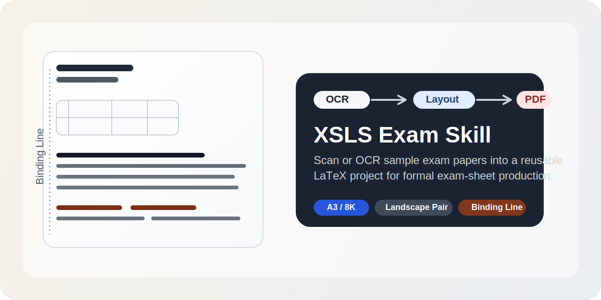

# xsls-exam-skill



一个面向数学试卷生产场景的本地 skill。

它用于把样卷图片、扫描 PDF、OCR PDF 转成符合正规考试卷规范的 LaTeX 试卷项目，并进一步编译成 PDF。

## 项目定位

这个 skill 不只是“提取试题文字”，而是面向**正式考试卷生产**的工作流：

- 先识别样卷版式骨架
- 再做分页规划
- 最后生成可持续修改的 LaTeX 项目和 PDF

适合需要反复改题、换题、重组试卷的场景，尤其适合数学试卷。

## 核心能力

- 支持 `A3` / `大8开`
- 支持横版双半页排版
- 支持左侧装订线
- 支持选择题、填空题、解答题、图题
- 支持先做版式骨架识别，再做分页规划
- 支持 `XeLaTeX` 编译输出 PDF

## 适用场景

- 数学老师复刻 OCR PDF / 扫描样卷
- 把样卷沉淀成可维护的 LaTeX 项目
- 按 `A3` / `大8开` 的正规试卷规格排版
- 需要处理选择题、填空题、解答题、图题混排

## 工作流

1. 输入样卷图片、扫描 PDF 或 OCR PDF
2. 判断纸张规格与页面结构
3. 生成 `pagination-plan.md`
4. 按半页块组织内容并输出 `main.tex`
5. 用 `XeLaTeX` 编译成 `main.pdf`

这一流程的重点不是“自动把内容塞满页面”，而是先识别试卷骨架，再做分页。

## 目录结构

- `SKILL.md`：skill 主说明
- `agents/openai.yaml`：UI 元数据
- `assets/templates/`：LaTeX 模板与分页规划模板
- `references/`：版式标准、自适应规则、自动识别与自动分页规则
- `scripts/`：项目初始化与编译脚本
- `examples/26-baimu-math-4/`：首个正式样卷案例

## 快速开始

### 1. 初始化项目

```bash
bash scripts/new_exam_project.sh ~/Desktop/my-xsls-exam
```

### 2. 编辑分页规划与主文件

初始化后，优先先看：

- `pagination-plan.md`
- `main.tex`

建议先填写分页规划，再开始正式排版。

### 3. 编译 PDF

```bash
bash scripts/compile_exam_latex.sh ~/Desktop/my-xsls-exam/main.tex --engine xelatex --use-latexmk --preview
```

## 安装到 autoclaw

如果你使用的是 `autoclaw/openclaw`，将整个仓库目录放到：

```bash
~/.openclaw-autoclaw/skills/xsls-exam-skill
```

确保最终存在：

```bash
~/.openclaw-autoclaw/skills/xsls-exam-skill/SKILL.md
```

然后重启 `autoclaw`。

## 使用示例

```text
使用 xsls-exam-skill 把样卷 PDF 转成 A3/大8开横版、带装订线的 LaTeX 试卷项目
```

## 正式案例

仓库中已内置第一份正式案例：

- `examples/26-baimu-math-4/`

这个案例用于验证：

- `A3` / `大8开` 切换
- 横版双半页逻辑
- 装订线位置
- 图题落位
- 数学试卷分页策略

## 边界说明

这个 skill 当前更适合：

- 规则较清晰的正式试卷
- 数学公式、分区、题型明确的样卷
- 需要保留正式成卷逻辑的场景

它并不追求：

- 100% 无校对自动化
- 任意扫描件一次性完美还原
- 用 Word 作为主生产格式

## 设计来源

这个 skill 在创建过程中参考并吸收了已有的 `latex-document` 与 `latex` 两个 skill 的思路，再围绕正规考试卷场景补充了试卷专用规则层。
